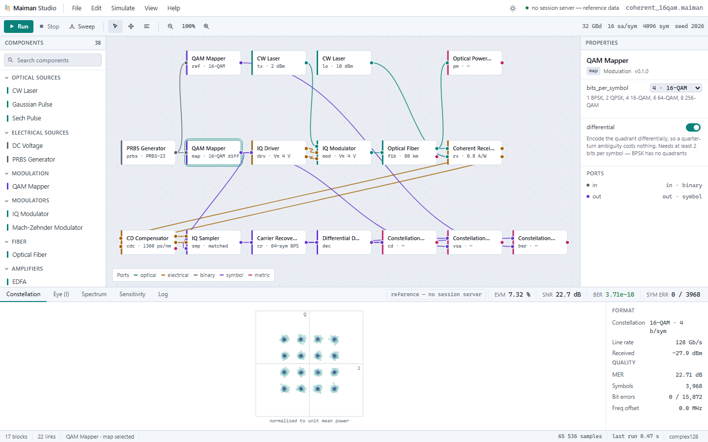
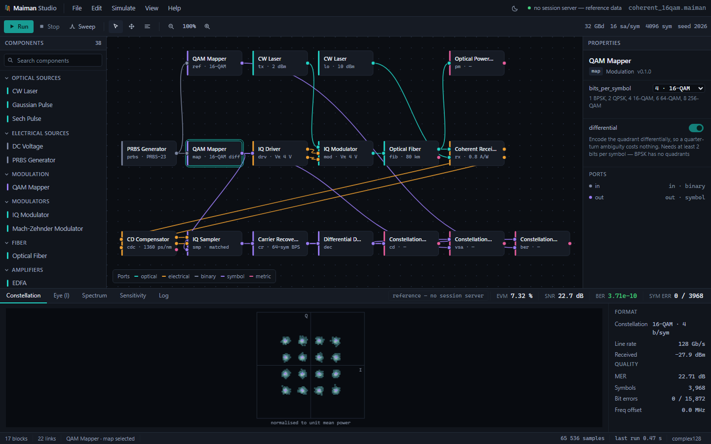

# Maiman Studio

**An open-source, modular simulator for optical communication links and photonic systems.**

*Named for **Theodore Maiman**, who fired the first working laser in May 1960 — the event every
link in this simulator descends from.*

[](https://github.com/ehsun-sh/maiman-studio/actions/workflows/ci.yml)


---

> ### ⚠️ Project status: pre-alpha — Phases 0, 1, 1.5 and 2 complete. No GUI yet.
>
> Two complete links run end to end and produce numbers that match theory.
> **Direct detection:** PRBS → NRZ → CW laser → MZM → fiber (loss + dispersion) → PIN → filter →
> eye/Q/BER. **Coherent:** PRBS → Gray-coded M-QAM → RRC shaping → IQ modulator → **fiber** →
> 90° hybrid with balanced detection → dispersion compensation → carrier recovery → EVM/SNR and
> counted errors, up to 256-QAM, and dual polarization at 256 Gb/s with a blind butterfly
> equaliser. The coherent chain now runs over a real span: 1000 km of fiber leaves nothing
> recoverable at the photodiode, and the receiver returns it to back-to-back quality.
> Every physics block is validated against a closed-form result in CI.
>
> Projects save to versioned JSON and sweeps are first-class, so a curve is one call rather than
> a hand-written loop that mutates the graph.
>
> Fiber nonlinearity is solved by adaptive-step split-step Fourier, EDFAs emit ASE into the
> noise-bin model so amplified multi-span links give correct OSNR **and a Q-factor that follows
> from it** — signal-ASE and ASE-ASE beat noise are modelled in both detector families, and in both polarizations — and PMD
> is drawn as a random realisation with the right Maxwellian statistics.
>
> Channels interact: the split-step propagates them coupled, so a neighbour's power modulates
> each channel's phase at twice the rate its own does, sliding past under walk-off derived from
> the dispersion — and triplets of channels mix to put light where nobody launched it.
>
> The interface is a working application: `maiman serve`, open the page, build a link by
> dragging blocks and wires, press Run, sweep a parameter, save the project. Every number on screen
> comes from the engine. See the [roadmap](#roadmap).
>
> This is not yet a useful simulator. It is a foundation with the expensive decisions made and
> tested. Criticism of those decisions is worth more right now than any feature —
> **[the architecture document](docs/ARCHITECTURE.md)** is where they are argued out.

---

## The interface

**It runs.**

    pip install git+https://github.com/ehsun-sh/maiman-studio
    maiman serve

then open `http://127.0.0.1:8765/`. The interface is a file inside the package, so installing the
engine installs it — there is nothing to build and no checkout to be standing in. From a checkout,
`python -m maiman.server` is the same command by another name. Press Run and the page posts its graph to the engine and draws
what comes back: the constellation, the measurements, the block captions, and a log in which every
line is a fact from the response. Change a parameter in the inspector and run again, and the
numbers move because the physics moved — set the fiber to 200 km and the received power drops by
exactly the 24 dB the extra loss costs, while the constellation collapses, because the dispersion
compensator is still set for the old span.

**The canvas draws the project document itself.** The blocks, the wires and the parameter values
are not written into the page. They are read from the same `.maiman` document the server accepts,
exported from the graph that produced the reference numbers, and Run posts that object straight
back. So the picture on the canvas, the values in the inspector and the graph the engine executes
are one description instead of three kept in agreement by hand — the hand-written copy that used
to live in the page had already drifted, and was missing four of the fiber's parameters.

**It is an editor.** Drag a block to move it. Drag from an output port to an input to wire them.
Click a component in the palette to add it, select a block or a wire and press Delete to remove it,
ctrl+Z to take it back. Then Run, on a graph that did not exist a minute ago.

A connection is refused while it is being dragged rather than when Run is pressed, and the refusal
says why — `binary cannot drive optical`, `fib.in already has a source`, `a block cannot feed
itself`. Port types are what make that possible, and it is the reason they have been in the signal
model since the first commit. An input with nothing feeding it is drawn hollow, because the engine
will refuse to run the graph and showing which port is the problem beats reporting it afterwards.

Built without React Flow, on the SVG canvas that was already there. That was a judgement call
against what PRODUCT.md had written down, taken because React Flow means npm and a bundler and this
project has no build step at all — the page still opens straight off disk with nothing installed,
which is how the README asks you to read it. The interaction layer is the part that would have had
to be written either way.

**Sweeps.** A single run answers *what does this link do*; a sweep answers *how far can it go*,
which is the question that gets asked more often. Pick a block and a parameter, give it a range,
and the curve appears beside the form that made it. Repeats draw the spread at each point, because
one BER estimate at a marginal operating point is a sample and not an answer. The endpoint sends
back **numbers, not pictures** — a curve is made of scalars, and shipping a 96×96 histogram at
every point would be megabytes to draw a line. Seven points of a coherent link is 6 kB.

The plot opens on the metric that *moved*. A sweep is run to watch something change, so the one
that changed most is the one worth showing — which is also what stops it opening on the analyser
downstream of the decoder, whose EVM is exactly zero at every point because it is looking at
symbols that have already been decided.

**Open and save.** `File → Save` writes a `.maiman` file: the same document the canvas draws, the
same one the server runs, with the block positions folded in. `File → Open` reads one back. Both
go through the browser — the file is chosen in the operating system's own picker and read locally,
and nothing is posted. A server that opened or wrote a path it was handed would be a different and
much worse program, and it would gain nothing: the file belongs to the person at the keyboard.
A file that is not a project says so and leaves the canvas alone rather than emptying it first and
explaining second.

The page also still opens straight off disk with nothing running, which is how it should be read
if you only want to look. It says which mode it is in rather than leaving it to be inferred: a
badge in the results dock reads **live** when the numbers came from this session's last run,
**stale — graph edited** when the graph has changed since, and **reference** when they came from
the run baked into the file. Numbers from four days ago and numbers from the last click must never
look alike. See [DESIGN.md](DESIGN.md) for why the rest of it looks like this.



It ships two grounds and defaults to paper, because a schematic is a document before it is a
screen and its plots leave the tool for reports and papers. Graphite is one click away:



Every wire colour is a wavelength rather than a preference — optical C-band cyan, electrical amber,
binary slate, symbol violet, metric magenta — so a glance at a link tells you what travels down it.
A typed-port system that refuses invalid wiring at edit time is worth nothing if the types are
invisible.

---

## Try it

```bash
pip install git+https://github.com/ehsun-sh/maiman-studio && maiman serve
```

or, to work on it:

```bash
pip install -e ".[dev]" && pytest
```

```python
from maiman import SimulationContext, Graph
from maiman.components import CWLaser, Combiner, Fiber, PowerMeter

ctx = SimulationContext(bit_rate=10e9, samples_per_symbol=16, sequence_length=64)
g = Graph(ctx)

laser = g.add(CWLaser(power=0.0, wavelength=1550.0))  # 0 dBm
fiber = g.add(Fiber(length=80.0, attenuation=0.2))  # 80 km, 0.2 dB/km
meter = g.add(PowerMeter())
g.chain(laser, fiber, meter)

print(g.run()[meter])  # PowerReading(-16.000 dBm; 1550.00nm=-16.000dBm)
```

Two carriers stay two independently sampled bands, which is the point of the signal model:

```python
g = Graph(ctx)
ch1 = g.add(CWLaser(wavelength=1550.0, label="ch1"))
ch2 = g.add(CWLaser(wavelength=1551.0, label="ch2"))
mux = g.add(Combiner(2))
fiber = g.add(Fiber(length=80.0, attenuation=0.2))
meter = g.add(PowerMeter())

g.connect(ch1, mux["in0"])
g.connect(ch2, mux["in1"])
g.chain(mux, fiber, meter)

print(g.run()[meter])
# PowerReading(-12.990 dBm; 1551.00nm=-16.000dBm, 1550.00nm=-16.000dBm)
```

Each band carries its own centre frequency, so channel spacing never enters the sample rate.
Put those two lasers 6 THz apart instead of 125 GHz and nothing about the run changes — which is
exactly what a single-carrier signal model cannot do.

## Results

`python examples/ook_link.py` builds a 10 Gb/s OOK link and characterises it. Abridged output:

```
Receiver sensitivity (back to back)        Dispersion-limited reach (0 dBm launch)
  launch      Q    BER (from Q)  counted     distance     Q    BER (from Q)
  -22 dBm   1.59     5.61e-02    460/8184        0 km   94.75    0.00e+00
  -20 dBm   2.51     6.09e-03     49/8184       40 km    9.26    1.03e-20
  -19 dBm   3.15     8.17e-04      7/8184       60 km    6.48    4.63e-11
  -16 dBm   6.25     2.11e-10   none counted    80 km    3.76    8.58e-05
  -14 dBm   9.83     3.99e-23   none counted   120 km    0.63    2.65e-01
```

Two things are worth reading off that. **Sensitivity is −16 dBm** for a Q of 6 — the right figure
for a PIN into a plain 50 Ω load. **Reach is ~62 km**, and it is set by dispersion, not by loss:
with dispersion switched off the same 60 km span gives Q = 15.4 instead of 6.5. That is the
textbook result for uncompensated 10 G NRZ on standard fiber.

The two columns are also a cross-check on each other. 120 km of 0.2 dB/km is 24 dB, and launching
0 dBm through it gives the same Q as launching −24 dBm back to back. Modulator, fiber, detector,
filter and analyzer all have to agree for that to hold; it is
[a test](tests/test_ber.py), not a coincidence.

Both curves come from `sweep()`, and the same script writes the schematic to
[`examples/ook_link.maiman`](examples/ook_link.maiman) — versioned JSON, diffable, runnable headless.

### Coherent

`python examples/coherent_link.py` runs the same treatment on a 32 GBd coherent link —
PRBS → Gray-coded M-QAM → IQ driver → IQ modulator → 90° hybrid with balanced detection —
and finds the received power each format needs for a BER of 1e-3:

```
format     rate      launch for BER 1e-3     SNR there   EVM there
BPSK          32 Gb/s      -38.0 dBm received        6.9 dB     45.2%
QPSK          64 Gb/s      -35.0 dBm received        9.9 dB     32.0%
16-QAM       128 Gb/s      -27.5 dBm received       17.4 dB     13.5%
64-QAM       192 Gb/s      -21.7 dBm received       23.2 dB      6.9%
256-QAM      256 Gb/s      -16.3 dBm received       28.7 dB      3.7%
```

The required-SNR column is the one to check against a textbook: 9.9 / 17.4 / 23.2 / 28.7 dB are
the standard figures for QPSK through 256-QAM at 1e-3. The step from BPSK to QPSK costs exactly
3 dB — the same energy per bit for twice the rate, which is why coherent systems start at QPSK
and never look back.

Nothing here is configured to come out right. The shot-noise-limited SNR is asserted against
`R·P/(2qB)`, the counted symbol errors against
[`ser_qam()`](src/maiman/modulation.py), and the modulator's 3 dB against `10·log10(2)`.

### What carrier recovery is for

With ordinary 100 kHz lasers and no phase recovery, 16-QAM at 32 GBd does not close — and, more
tellingly, **launching more power stops helping**:

| launch | without recovery | with recovery |
| ---: | :--- | :--- |
| −14 dBm | 14.6 dB, BER 6e−3 | 22.1 dB, BER 4e−9 |
| −10 dBm | 15.1 dB, BER 4e−3 | 25.7 dB, BER 4e−18 |
| −6 dBm | 15.3 dB, BER 4e−3 | 28.7 dB, BER 1e−34 |
| −2 dBm | 15.9 dB, BER 2e−3 | 30.9 dB, BER 2e−56 |

Twelve dB of extra power buys 1.3 dB. Laser phase noise is a random walk, so it is not removable by
subtracting a constant or a line, and it puts a ceiling on SNR that no power budget lifts.
[`CarrierRecovery`](src/maiman/components/coherent.py) removes the ceiling using the blind phase
search of Pfau et al. Both halves of that claim are [asserted](tests/test_dsp.py) — the second
would be meaningless without the first.

### Reaching past the bench

Every coherent example above was back to back. `python examples/dispersion_link.py` puts the same
32 GBd 16-QAM link through real fiber, with loss and nonlinearity switched off so that chromatic
dispersion is the only thing acting:

```
            accumulated   spread          uncompensated              compensated
  span          [ps/nm]  [symbols]      EVM       SNR    errors      EVM       SNR
       0 km          0       0.0      1.68%    35.51 dB      0/3968     1.68%    35.51 dB
       5 km         85       0.8     17.04%    15.37 dB      5/3968     1.67%    35.52 dB
      20 km        340       3.3    217.64%    -6.75 dB   3336/3968     1.67%    35.56 dB
      80 km       1360      13.4   2542.45%   -28.11 dB   3698/3968     1.68%    35.52 dB
     400 km       6800      67.0   2686.86%   -28.58 dB   3692/3968     1.67%    35.55 dB
    1000 km      17000     167.4   3390.48%   -30.61 dB   3697/3968     1.68%    35.51 dB
```

Read the uncompensated column first, because it is the reason this block exists. **Five kilometres
— a metro hop — costs twenty decibels.** At 80 km the link is not degraded, it is gone: 3698 of
3968 symbols wrong is 93%, and blind guessing on 16-QAM gives 93.75%. The whole coherent phase had
been validated without ever meeting the impairment that dominates every real span.

The compensated column is the argument for coherent detection in one line. **Back-to-back quality
at every distance, with no penalty that grows with it.** Dispersion is an all-pass phase — it
rearranges the field in time and removes nothing — so a receiver that measures the field still
holds all of it, and one static filter puts it back. That is not error correction; it is inverting
an invertible operation. A direct-detection receiver squares the field at the photodiode, destroys
the phase, and can never do this at all, which is why it has to carry dispersion-compensating fiber
in the line instead.

The setting is sharp, and that is worth seeing rather than being told:

| compensator set to | error | EVM | SNR |
| ---: | ---: | ---: | ---: |
| 76 km | −68 ps/nm | 13.64% | 17.30 dB |
| 79 km | −17 ps/nm | 3.78% | 28.46 dB |
| **80 km** | **0** | **1.68%** | **35.52 dB** |
| 81 km | +17 ps/nm | 3.77% | 28.47 dB |
| 84 km | +68 ps/nm | 13.64% | 17.30 dB |

Being one kilometre out costs 7 dB. The symmetry of those flanks is also the sign check: a
compensator applying its correction the wrong way round would put the nominal setting at *twice*
the span, and the two sides would not match to three digits.

**Why this is a separate stage from the butterfly equaliser.** Both are linear filters, so one
adaptive filter could in principle do both jobs. It does not work. On the dual-polarization link
over 80 km, growing the butterfly from 7 taps to 65 — the longest the block allows, and nine times
the cost — leaves the link just as dead, because a blind modulus criterion has no gradient to
follow once the constellation is smeared into a Gaussian blob. The static block ahead of a 7-tap
filter restores back-to-back quality outright. Dispersion is static and *long*; polarization
mixing is fast and *short*; one filter serving both would have to be both, which is the worst of
each. That ordering is [asserted](tests/test_cd_compensation.py), not quoted.

### Dual polarization

`python examples/dualpol_link.py` puts two independent 16-QAM tributaries on orthogonal
polarizations of one wavelength — **256 Gb/s** — and rotates the state the way a fibre does:

```
rotation    without equaliser              with equaliser
    0 deg  EVM    2.5 /    2.5 %      0 err      EVM 2.50 / 2.57 %    0 err
   15 deg  EVM   28.1 /   29.2 %   1416 err      EVM 2.51 / 2.58 %    0 err
   30 deg  EVM  218.0 /  123.5 %   6217 err      EVM 2.52 / 2.51 %    0 err
   45 deg  EVM  278.5 /  365.2 %   6763 err      EVM 2.48 / 2.55 %    0 err
   72 deg  EVM   85.7 /  165.6 %   5523 err      EVM 2.54 / 2.56 %    0 err  (swapped)
   90 deg  EVM    2.5 /    2.5 %      0 err      EVM 2.54 / 2.48 %    0 err  (swapped)
```

Past a few degrees the unequalised branches are not degraded — they carry no recoverable data at
all, because each is a *mixture* of both tributaries. The
[butterfly equaliser](src/maiman/dsp.py) separates them blind, with no training sequence anywhere in
the link. Read the two end rows together: 90° is a clean swap rather than a mixture, so it needs no
equaliser at all and simply delivers the tributaries the other way round — which is also why
nothing blind can label them, and why a real link recovers the pairing from framing.

This is the increment that finally exercises `Ey`, which has been in the signal model since the
first commit for exactly this purpose.

### Shaping and differential encoding

Two transmitter refinements that close out the coherent phase.

**Root-raised-cosine shaping** bounds the spectrum. A held symbol has a sinc spectrum that never
ends — fine for one channel alone, useless once neighbours are packed onto a grid. At a 0.2
roll-off, **99.5%** of the shaped power falls inside ±0.6 symbol rates, against 83.6% for a held
symbol. The shaping is split into a root at each end, so the cascade is Nyquist (zero at every
symbol instant but its own) *and* the receiver's filter is matched to the transmitted pulse. One
end alone gives neither.

A shaped waveform overshoots between symbols, so its peak-to-average ratio is higher than the
constellation's and a full-swing drive clips — about 7% EVM at 16-QAM, falling to 1% backed off.
That is real, and backing off is what a transmitter does about it.

**Differential quadrant encoding** closes the quarter-turn ambiguity that every blind stage leaves
behind: the phase search cannot resolve it, and neither can the butterfly equaliser. Under plain
Gray labelling a quarter turn permutes the bits differently for every point; under a
quadrant-relative labelling it does exactly one thing, so differencing the quadrant makes it cancel.
A quarter turn that destroys **>75%** of absolutely-labelled symbols costs a differentially encoded
link nothing but its first symbol.

```python
result = sweep(graph, {("laser", "power"): [-24.0, -21.0, -18.0]}, runs=8)
q = result.metric(analyzer, lambda m: m.q_factor)     # shape (points, runs)
```

Repeats matter more than they look. At −20 dBm, eight runs of the same link give error counts of
37 to 58 — a 50% spread on the thing being measured, while Q itself is stable to ±1%. A single
BER at a marginal operating point is one sample, not an answer.

### Amplified and nonlinear

`python examples/amplified_link.py` runs a chain of 80 km spans, each amplified back to transparency:

```
  spans   reach     OSNR      vs. one span            Sech pulse over 4 soliton periods
      1     80 km   36.95 dB    +0.00  (theory -0.00)   configuration      width   peak
      2    160 km   33.94 dB    -3.01  (theory -3.01)   soliton (N = 1)    x1.00   x1.00
      4    320 km   30.93 dB    -6.02  (theory -6.02)   half the power     x2.62   x0.40
      8    640 km   27.92 dB    -9.03  (theory -9.03)   no nonlinearity    x4.12   x0.23
     16   1280 km   24.91 dB   -12.04  (theory -12.04)  no dispersion      x1.00   x1.00
```

The left table tracks `10·log10(N)` to a hundredth of a dB over sixteen spans, and nothing in the
model is written in those terms — the noise bins just accumulate. The single-span figure of
36.95 dB is `58 − 16 − 5`: the quantum floor, the span loss the amplifier has to make up, and its
noise figure.

The right table is the soliton. At N = 1 the chirp the Kerr effect imposes cancels the one
dispersion imposes and the pulse is unchanged after 29 km; halve the power and the balance breaks.
The last row is the honest caveat — self-phase modulation *alone* also preserves `|A(T)|`, so
shape invariance proves nothing by itself. It is invariance with both effects active that is the
result.

### What ASE beat noise is for

An amplifier's OSNR is only half an answer. A photodiode squares the field, so ASE arriving with
the signal *beats* against it rather than merely adding its power — and on any amplified link that
beat term is the noise floor. Without it this project could compute OSNR to a hundredth of a dB
over sixteen spans and then report a Q that had almost nothing to do with it:

```
8 x 80 km, each amplified to transparency, 10 Gb/s OOK

   NF       OSNR    Q before    Q now   Q from OSNR
  4 dB   25.96 dB     118.73    22.79         25.08
  8 dB   21.96 dB     113.72    14.50         15.59
 14 dB   15.96 dB      94.83     6.83          7.51
```

The middle column is the old model. Ten decibels of OSNR cost it **nothing at all** — Q moved from
118.7 to 94.8 while the link's optical margin collapsed — because the only thing ASE contributed
was mean power and its shot noise. The right-hand column is the textbook relation
`Q = 2·√(B_ref/B_e)·OSNR/(1+√(1+4·OSNR))`, checked first against its own known point: 14.5 dB must
give Q ≈ 6, which is the industry figure for 10 Gb/s at 1e-9.

The model now sits **just below** that limit at every point, which is the right side to be on — it
carries shot, thermal and finite-extinction effects the closed form omits.

Coherent detection has the same term, with ASE beating against the local oscillator instead, and
there the check is `SNR = 2·OSNR·B_ref/R_s`. The gap closes as ASE takes over, which is what makes
it a test of the beat term rather than of one operating point:

| noise figure | OSNR | SNR | optical limit | gap |
| ---: | ---: | ---: | ---: | ---: |
| 4 dB | 22.08 dB | 18.82 dB | 21.01 dB | 2.18 dB |
| 10 dB | 16.08 dB | 14.32 dB | 15.01 dB | 0.69 dB |
| 16 dB | 10.08 dB | 8.78 dB | 9.01 dB | **0.23 dB** |

Only ASE co-polarized with the signal beats with it, which is why a polarizer helps a receiver and
why a coherent front end needs no optical filter at all: it is filtered by its own electrical
bandwidth, so the ASE-ASE term that forces a direct-detection receiver to carry one is absent by
construction.

### Wavelength selection, and what a filter is really for

`python examples/wdm_demux.py` puts four channels on a 100 GHz grid through four amplified spans
and demultiplexes one. Because every band carries its own centre frequency, that is a real
wavelength-selective operation and not a choice of array index — a filter tuned *between* two
channels attenuates both.

The second job is the one that surprises people. An amplifier emits ASE across four terahertz and
every hertz of it reaches the photodiode and beats there:

| link | OSNR | ASE power | Q | vs OSNR limit |
| :--- | ---: | ---: | ---: | ---: |
| no demultiplexer | 29.93 dB | 0.3250 mW | 7.43 | 0.19× |
| 50 GHz demux | 26.92 dB | 0.0040 mW | 25.04 | **0.89×** |

Eighty times less ASE reaches the diode, and the demultiplexed link lands just under its own OSNR
limit — which is where a real receiver sits. **The OSNR figure barely moves**: it is quoted in a
fixed 12.5 GHz reference bandwidth, so it cannot see ASE removed outside that band. The cheapest
improvement available to a receiver is invisible to the number everyone quotes.

The filter's skirts are floored at a declared `extinction`, because a super-Gaussian's are not. A
third-order 50 GHz passband is `exp(-2838)` one channel spacing away — not a small number but
exactly zero in double precision, which would make rejection infinite and a chain of filters
accumulate no crosstalk at all. Real hardware specifies 30–50 dB and it is that floor, not the
shape, that decides what leaks through a long line of them.

The **[OSA](src/maiman/components/filters.py)** finally makes the signal model visible: bands and
noise bins rendered onto one grid, the way an instrument shows them. Its resolution bandwidth is
not cosmetic — widening it raises the ASE trace decibel for decibel and leaves a carrier exactly
where it is, which is the clearest demonstration of why OSNR needs a stated reference bandwidth.

## The kernels do not know what they are running on

The propagation kernels are the only part of this worth a GPU: a loop over FFTs on a long array,
where everything else is scalar arithmetic or a closed form evaluated a few dozen times.
[`maiman/kernels.py`](src/maiman/kernels.py) was written as array-to-array functions from the
beginning so that this could be added without touching anything above it, and
[`maiman/backend.py`](src/maiman/backend.py) is the whole of the addition.

**The arrays decide, not a setting.** A kernel handed CuPy arrays runs on CuPy and returns CuPy
arrays; handed NumPy arrays it runs on NumPy. There is no global mode and no flag on the context,
which matters because the kernels are pure functions and a hidden mode would be the one piece of
state that could make the same inputs give different answers. Dispatch is on the array's own type —
`type(a).__module__` names the package it came from — so there is no registry to keep in sync.

**CuPy is not exercised here**, and saying otherwise would be the kind of claim this project exists
to avoid: there is no device and no install in CI. What *is* tested is the half that would actually
break a port. A second array library — [`tests/hostile_backend.py`](tests/hostile_backend.py) — sets
`__array_function__` to `None`, which is NumPy's own way for a type to say it is not NumPy's, so
`np.fft.fft` on one of its arrays raises. Universal functions are deliberately left working, because
`np.exp` on a CuPy array dispatches and comes back a CuPy array; refusing them would be testing a
rule that is not true. What breaks a port is anything that *allocates* — `np.fft.fftfreq` and
`np.zeros` build on the host, and a kernel calling one inside its loop pays a transfer every step.

Every kernel is then run on both libraries and the results compared, and the names the second one
was asked for are recorded. That set is the contract, and it is asserted as an equality rather than
a lower bound:

    abs  complex128  conj  exp  float64  max  pi
    fft.fft  fft.fftfreq  fft.ifft  fft.irfft  fft.rfft  fft.rfftfreq

Thirteen names. A change that reaches for something only NumPy has fails in this repository rather
than on somebody's GPU, and one that stops needing something fails too. CuPy provides all thirteen.

Only the propagation path is converted. The four-wave-mixing closed forms and the 2×2 Jones algebra
are scalar work a device would slow down, and there is a test naming which functions are in and
which are out, so the line is a decision rather than an oversight.

## 400G and 800G, and what they cost

Three reference transceivers, all dual-polarization coherent, all derived from one number and
arithmetic. 400G is DP-16QAM at 59.84 GBd — the shape a 400ZR module has. 800G is that payload
doubled, and there are two ways to double it:

| configuration | GBd | line rate | payload | slot | b/s/Hz |
| :--- | ---: | ---: | ---: | ---: | ---: |
| 400G DP-16QAM | 59.84 | 479 Gb/s | 400 G | 75 GHz | 5.33 |
| 800G DP-16QAM | 119.68 | 957 Gb/s | 800 G | 150 GHz | 5.33 |
| 800G DP-64QAM | 79.79 | 957 Gb/s | 800 G | 100 GHz | 8.00 |

Line rate is baud × bits × 2 polarizations; a 400 Gb/s payload inside 479 leaves 16.4 % for forward
error correction and framing. **Nothing here is quoted from a standard** — the 800G symbol rates
follow from the 400G one, and the required OSNR below is *measured*: a noise-loaded link, bisected
until the **counted** bit error rate lands on the threshold, then compared against a relation that
knows nothing about any of it.

| configuration | closed form | ideal DSP | penalty | blind equaliser |
| :--- | ---: | ---: | ---: | ---: |
| 400G DP-16QAM | 19.47 dB | 19.78 dB | +0.31 | 20.25 dB |
| 800G DP-16QAM | 22.48 dB | 22.86 dB | +0.38 | 23.32 dB |
| 800G DP-64QAM | 26.41 dB | 27.22 dB | +0.81 | 38.03 dB |

The closed form assumes a perfect transmitter, perfect DSP and a noiseless receiver, so the fourth
column is the transmitter's implementation penalty — growing with the format order, because a
denser constellation is less forgiving of the modulator's curvature.

**The fifth column is a finding, not a specification.** Nothing rotates the polarization on this
bench, so the blind butterfly equaliser has nothing to undo and should be free. At 16-QAM it is. At
64-QAM it diverges and costs eleven decibels: nine constellation radii sit close enough together
that a noisy sample snaps to the wrong one, and the correction that follows is large and in the
wrong direction. A single tap recovers all of it and a step ten times smaller most of it, so the
structure is right and the adaptation is not.

That was chased down. It is not the step and not the decision: freezing the radius-directed stage
entirely still leaves 3249 errors, which is what identified the **first** stage as the culprit.
Driving every sample onto one radius is right for QPSK, survivable for 16-QAM, and destructive for a
constellation whose points run from 0.218 to 1.528 on a unit-power grid — the amplitude structure
the format carries is the thing being flattened. And the same stage is what carries a rotated
channel, so there is no setting that does both:

| `cma_fraction` | 0° | 15° | 30° | 45° | 72° | 90° |
| :--- | ---: | ---: | ---: | ---: | ---: | ---: |
| 0.5 (default) | 3568 | 3552 | 2950 | 5397 | 3762 | 3048 |
| 0.0625 | 1493 | 1333 | 7496 | 7390 | 7298 | 1530 |
| 0.0 | 0 | 395 | 7056 | 7466 | 7497 | 0 |

Four ways out were measured — gating the second stage's decision on whether the ring it picked was
credible, normalising the update by the window energy so gradient noise stops scaling with the tap
count, annealing the second stage's step, and shortening the first stage. Only the last moves
anything, and it moves it the other way. What this needs is a different first stage — multi-modulus,
or a partial constellation — which is a piece of work rather than a parameter. `cma_fraction` is now
reachable so the trade is at least the user's to make, and there is a test that will fail when a
first stage that does both arrives.

With the DSP out of the way, the 800G choice is two numbers:

    twice the baud, same format    +3.08 dB of OSNR, twice the spectrum
    denser format, less baud       +4.36 dB of OSNR, two thirds of it

The first is the price of bandwidth and is 3 dB in theory: twice the symbol rate collects twice the
noise and nothing else changes. The second buys a third of the spectrum back, and is what a link
with filled fibre and optical SNR to spare pays for it.

`maiman.analysis` carries the bridge these rest on — `snr_from_osnr`, `snr_for_ber` and
`required_osnr` — and the two reference designs ship as
[`examples/zr400.maiman`](examples/zr400.maiman) and
[`examples/zr800.maiman`](examples/zr800.maiman), laid out and openable in the studio.
[`examples/reference_rates.py`](examples/reference_rates.py) builds them and prints the tables.

## Mixing products add in field, not in power

A link is not one fibre. The four-wave mixing product a span generates arrives on top of the one
the span before it generated, and whether those add or cancel is decided by how far the pumps and
the product have drifted apart over the fibre already behind them. That drift is the phase mismatch
integrated over the distance travelled, and it used to be thrown away: every span drew its products
a fresh random phase, so they added in power and a four-span link came out four times one span
instead of sixteen.

Three carriers at −30 dBm, four 80 km spans against one, each span's loss exactly undone:

| span | D = 0 | × one span | D = 17 | × one span |
| ---: | ---: | ---: | ---: | ---: |
| 78 km | −104.06 dBm | 16.00 | −180.98 dBm | 0.03 |
| 80 km | −104.04 dBm | 16.00 | −154.84 dBm | 13.17 |
| 82 km | −104.02 dBm | 16.00 | −166.46 dBm | 0.89 |
| 85 km | −103.99 dBm | 16.00 | −160.89 dBm | 3.12 |

**The sharp form of the claim is that cutting a span in half must change nothing.** A span boundary
is a bookkeeping decision, not a physical one, so 320 km of lossless fibre must give the same
product whether it is run as one block or as eight — and it now does, to under a hundredth of a
decibel, at every dispersion. Adding the pieces in power put eight of them 9 dB below one.

Note what is *not* claimed: that dispersion suppresses the build-up. At the right span length it
does the opposite — the rotation per span comes back round to a multiple of 2π and the spans stack
again, which is the 13.17 in the table. That periodic re-phasing is a real property of a
dispersion-managed link and is why the map is designed rather than chosen; a model that reported
"less" would be reporting something false.

**One number carries all of it.** The mismatch is a difference of four propagation constants at
frequencies satisfying `ω_i + ω_j = ω_k + ω_F`, so the constant and group-delay terms cancel
identically and only the β₂ term survives. The signal therefore carries a single accumulated
`Σ β₂·L` and nothing about any band's absolute phase — which is fortunate, because `β₀·L` is of
order 10¹¹ radians over 80 km and reducing that modulo 2π in double precision would leave about
five digits of the answer. A dispersion-compensating span is a fibre with negative D, so it
subtracts from that sum on its own; nothing special is done for it.

What remains drawn is one phase per *triplet*, standing in for the pump phase combination that
modelling the pumps by their powers has thrown away. It is keyed on the three pump frequencies and
on nothing else — not on the block, not on which span it is — because the same three pumps make the
same product wherever they are, and a phase redrawn per block is precisely what made the spans
average instead of add. What is still missing is the pumps' own nonlinear phase: only the linear
mismatch is tracked between spans.

## The short wavelengths pump the long ones

A photon can scatter off a silica vibration and come out at a lower frequency, and the process is
stimulated — light already there at the lower frequency makes it more likely. So in a comb the
short-wavelength channels pump the long-wavelength ones, and a flat launch does not arrive flat.
Set `raman_gain_slope` on the fibre. One 80 km span of standard fibre, everything launched at
0 dBm:

| comb | total | span | tilt |
| :--- | ---: | ---: | ---: |
| 4 × 100 GHz | 6.0 dBm | 0.30 THz | +0.00 dB |
| 40 × 100 GHz | 16.0 dBm | 3.90 THz | +0.40 dB |
| 80 × 50 GHz | 19.0 dBm | 3.95 THz | +0.81 dB |
| 80 × 100 GHz | 19.0 dBm | 7.90 THz | +1.63 dB |

A filled C band loses most of a decibel across itself every span, and it accumulates. That is a
large fraction of the margin a link is designed with, and it is why a line system is built with a
tilt to undo rather than assumed flat. A four-channel comb — which is what every other WDM number
here is measured on — moves by three thousandths of a decibel, which is why this was never missed.

**Power is moved, not lost.** The tilt is a closed form (Zirngibl, *Electron. Lett.* 34(8), 1998)
and the sum over channels is unchanged to floating point; the quantum defect the lattice keeps is a
part in ten thousand at these separations and is not modelled. That conservation is also what makes
a sign error impossible to hide — the two ends have to move in opposite directions or the sum
cannot come out.

The gain is taken as rising linearly with separation, which it does up to about 13 THz and not past
it, so a comb spanning the C and L bands together has its far pairs over the peak and the transfer
between them over-predicted. The `diagnostics` port reports the tilt in dB, so what happened is a
number rather than an assumption.

## An orthogonal neighbour is not an absent one

The Kerr coupling used to be scalar per polarization: a channel was modulated by its neighbours'
co-polarized power and by nothing else, so a channel polarized across it counted for zero. In an
isotropic medium orthogonal power counts for exactly two thirds — which, since co-polarized
cross-phase modulation already carries its factor of two, makes orthogonal cross-phase modulation
exactly **one third** of co-polarized. Set `cross_polarization` on the fibre:

| neighbour | axes uncoupled | axes coupled |
| :--- | ---: | ---: |
| co-polarized | 2.000 γPL | 2.000 γPL |
| orthogonal | 0.000 γPL | 0.667 γPL |

The same coefficient does two more things, because it is the same coefficient. A channel's own
orthogonal component modulates it at two thirds the rate, so power split evenly between the axes
turns each of them by `(0.5 + ⅔·0.5)·γPL` instead of `0.5·γPL`. And the two axes, no longer
accumulating the same phase, rotate the state of polarization as the power moves — nonlinear
birefringence, which falls by a factor of three, and cross-polarization modulation, which is that
rotation being driven by a *different* channel's power.

The value is the fixed-axis one, from the χ⁽³⁾ tensor rather than from any averaging. A fibre whose
birefringence scrambles faster than the nonlinearity acts is the Manakov regime instead, where the
distinction washes into a single 8/9 on the total power; this block applies PMD as a separate
element rather than interleaving it, so the fixed-axis form is the one consistent with the rest of
it. The coherent `A_x* A_y²` term, which would exchange power between the axes rather than only
dephase them, is left out — it is the part that averages away first — and the tests assert the
axes' powers are unchanged to twelve digits, so that omission is a number rather than a sentence.

Off by default, and with all the light on one axis it changes nothing at all — on the samples,
which is what makes it safe to leave on for a dual-polarization link and pointless for a
single-polarization one.

## D is not one number

Standard fibre gains 0.058 ps/nm/km of dispersion for every nanometre up the
band. Set `dispersion_slope` and the fibre stops pretending otherwise — and the same
coefficient shows up in two places at once, because it is the same coefficient.

**Across a comb**, channels no longer share a dispersion, so one compensator setting cannot serve
all of them. Over 80 km, with the compensator set for 1550 nm:

| channel | D there | D·L there | mismatch | EVM, one setting | EVM, its own |
| ---: | ---: | ---: | ---: | ---: | ---: |
| 1550 nm | 17.000 | 1360.0 | +0.0 | 1.68 % | 1.68 % |
| 1554 nm | 17.232 | 1378.6 | +18.6 | 4.07 % | 1.68 % |
| 1558 nm | 17.464 | 1397.1 | +37.1 | 7.76 % | 1.68 % |
| 1566 nm | 17.928 | 1434.2 | +74.2 | 15.23 % | 1.68 % |

That is the same size of penalty as the mis-settings table above it, arriving without anybody
having mis-set anything. It is why a single dispersion-compensating fibre never flattened a whole
C-band, and why coherent receivers carry a per-channel setting.

**Within one channel** the slope is a cubic phase, and cubic phase broadens a pulse
*asymmetrically* where β₂ broadens it evenly. It is honestly small at these baud rates: over
1000 km the cubic phase across a 32 GBd band is about 0.04 radians and costs a tenth of a point of
EVM. `accumulated_slope` on the compensator removes it anyway, and the test that it does is worth
having because a slope compensation with the wrong sign *doubles* the residue rather than removing
it — and nothing about the width of a pulse could ever tell you.

**β₃ is not the slope by another name.** Even at zero slope a fibre has a nonzero β₃, because
holding D flat across wavelength is itself a statement about how β₂ varies:

    beta3 = (lambda^2 / 2*pi*c)^2 * (S + 2*D/lambda)

For standard fibre at 1550 nm, D = 17 and S = 0.058 give β₃ = 0.13 ps³/km, the value the
literature quotes. Feeding it S = 0.09 — the slope at the *zero-dispersion* wavelength, which is
the number datasheets lead with — gives 0.18, and is the easiest way to be forty percent wrong.

The cubic term's sign is derived from the same Taylor expansion of β(ω) that gives the group delay
and the dispersion, not written down, because with this module's transform pair the quadratic and
cubic terms land on *opposite* signs. Broadening is even in β₃, so a sign error produces exactly
the right width and exactly the wrong skew; the tests measure the skew.

Left at zero the slope changes nothing. Every number taken before it existed still comes out, on
the same samples.

## Finding the dispersion without being told it

A dispersion compensator has to be set to within a few ps/nm. Over 80 km at 32 GBd the true value
is 1360, and being 17 out — one kilometre of fibre — takes the EVM from 1.7 % to 3.8 %, while 136
out lands the symbols at chance. It is not a knob to be roughly right about, because the residual
after a mismatch *is* the mismatch.

No deployed receiver is ever told the number. It measures it during acquisition, from the signal,
before the equaliser or the carrier loop have converged. Set `estimate` on the compensator and it
does the same:

| span | accumulated | estimated | error | EVM declared | EVM blind |
| ---: | ---: | ---: | ---: | ---: | ---: |
| 0 km | 0 ps/nm | −7.4 | −7.4 | 1.68 % | 2.23 % |
| 20 km | 340 ps/nm | 336.4 | −3.6 | 1.67 % | 1.82 % |
| 80 km | 1360 ps/nm | 1355.3 | −4.7 | 1.68 % | 1.92 % |
| 400 km | 6800 ps/nm | 6793.9 | −6.1 | 1.67 % | 2.05 % |
| 1000 km | 17000 ps/nm | 16991.5 | −8.5 | 1.68 % | 2.39 % |

The last two columns are the ones to read together: being right in ps/nm is not the claim, leaving
behind a link as good as one that was handed the answer is.

**Two stages, because no one statistic does both jobs.** The intensity of a modulated signal
repeats at the symbol rate, so `|A|²` carries a line there — and dispersion gives every pair of
frequencies a symbol rate apart a relative phase that grows with frequency, so their contributions
cancel and the line fades. Scanning that line across ±20000 ps/nm acquires the value with an
enormous capture range and an error of tens of ps/nm. Then a second stage minimises how Gaussian
the intensity looks, which has curvature exactly where the tone is flat.

The scan never compensates anything. The line at the symbol rate is a correlation of the spectrum
with itself shifted by that rate, and compensation only multiplies the spectrum by a phase, so
every candidate is one dot product against a product computed once from a single transform. It is
an identity, held to 1e-12 against compensate-then-transform in the tests, and it made 400
candidates over a 65536-sample window twenty times cheaper.

**It needs excess bandwidth**, and says so: at zero roll-off the tone this searches for does not
exist at all. Between there and roll-off 0.1 it exists but acquisition comes in a consistent
950 ps/nm low, and what recovers those runs is refinement walking its window in rather than any
warning from the contrast figure — which scored 29 on a run that was wrong by 950 and 32 on one
that was right. Resolution also scales as 1/R\_s²: the same link at 10 GBd lands 44 ps/nm out where
32 GBd lands 5. All of that is in
[`estimate_dispersion`](src/maiman/dsp.py)'s docstring, measured rather than asserted, and the
third table of [`examples/dispersion_link.py`](examples/dispersion_link.py) prints it.

## What channels do to each other

Until recently bands propagated independently through the fiber, which made this a good model of
one channel and an optimistic model of a comb. They no longer do. The same `|A|²A` term that gives
a channel its own self-phase modulation lets every *other* channel rotate its phase — and the
coefficient is not free. Expanding the term for a sum of carriers, a channel's own power appears
once and a neighbour's appears twice, because there are two ways to choose which un-conjugated
factor belongs to the neighbour and one way when it is the channel itself.

That factor of two is measurable, and it is exact:

| co-propagating channels | mean nonlinear phase | vs one channel | closed form |
| :--- | ---: | ---: | ---: |
| 1 | 0.027518 rad | 1.000× | 1× |
| 2 | 0.082559 rad | 3.000× | 3× |
| 3 | 0.137600 rad | 5.000× | 5× |
| 4 | 0.192640 rad | 7.000× | 7× |

**Dispersion is the cure here, not the disease.** Chromatic dispersion is normally introduced as
something to compensate. Between channels it is the only thing keeping them apart: it makes them
travel at different speeds, so a neighbour's bit pattern *slides past* instead of sitting on top of
the channel it is modulating. Walk-off is therefore not a separate parameter — it is the
group-delay term of the same expansion of β(ω) that produces the dispersion, so setting D to zero
removes both at once. At 17 ps/nm/km a 100 GHz neighbour separates by 13.62 ps/km, and has slid 140
symbols by the end of a 320 km link.

What walk-off removes is not the cross-phase modulation but its *variation*. The mean phase shift
is fixed by the neighbour's average power and no amount of sliding changes it — sliding
redistributes in time, it does not destroy. That split is the whole mechanism, because a constant
phase offset is absorbed by carrier recovery for free and it is the variation that closes an eye.
Measured on channel 1 of a four-channel QPSK comb over 4 × 80 km, as EVM after carrier recovery:

| launch/channel | D = 0 | D = 17 ps/nm/km |
| :--- | ---: | ---: |
| −3 dBm | +0.18 % | +0.00 % |
| 0 dBm | +0.49 % | +0.03 % |
| +3 dBm | **+2.84 %** | **+0.29 %** |

Ten times less penalty for having dispersion in the fiber.

**Four-wave mixing lands on the channels.** Products appear at `f_i + f_j − f_k`, and on an equally
spaced grid those frequencies *are* channel frequencies — so the crosstalk arrives in band, where
no filter downstream can reach it. The model folds such a product into the channel it lands on,
with a phase drawn from the run's generator for the same reason PMD is drawn: it is set by fiber
details nobody measures. Dispersion suppresses mixing too, by dephasing it, and the phase mismatch
grows as the *square* of the channel spacing:

| channel spacing | D = 0 | D = 2 | D = 17 |
| :--- | ---: | ---: | ---: |
| 25 GHz | 0.0 dB | −4.4 dB | −21.2 dB |
| 50 GHz | 0.0 dB | −14.7 dB | −33.1 dB |
| 100 GHz | 0.0 dB | −26.7 dB | −45.4 dB |
| 200 GHz | 0.0 dB | −38.6 dB | −57.4 dB |

Zero-dispersion fiber is perfectly phase matched at every spacing, which is the whole reason
dispersion-shifted fiber was abandoned for WDM.

The two effects are computed differently, and the difference is worth knowing before reading a
number off the block. Cross-phase modulation is solved on the waveform inside the split-step,
because it depends on the neighbour's instantaneous power sliding past; four-wave mixing is solved
in closed form from the band powers and injected as tones, because the products land at frequencies
no band is sampled at. Not putting the channels on one grid is what makes a WDM comb affordable at
all, and that choice has to be paid for somewhere. See
[`examples/wdm_nonlinear.py`](examples/wdm_nonlinear.py).

## The session server

    maiman serve

Three routes, no dependencies beyond the ones the engine already has, bound to loopback.

| route | what it does |
| :--- | :--- |
| `GET /api/manifests` | Every registered component: parameters with units and bounds, ports with types |
| `POST /api/run` | A `.maiman` project document in, results out |
| `POST /api/sweep` | A project, an axis and a range in; a curve out, as numbers |
| `GET /api/health` | Whether it is up, and how many components it knows |

**It is an ordinary client of the public Python API.** Every route is a thin wrapper over something
a script can already call — `manifests()`, `graph_from_dict()`, `Graph.run()`. Nothing in the
server knows any physics and nothing in the engine knows the server exists, which is what stops
the two drifting apart: a feature unreachable from Python is unreachable from the interface too.
The `Results.items()` the server needs is public for the same reason.

**Reduction happens in the engine, never in the browser.** A run holds tens of thousands of samples
per port; an eye diagram drawn from them is a 96×96 histogram. So a signal-carrying port encodes to
a *summary* — how many samples, at what rate, how much power — and anything meant to be looked at
arrives already reduced, from a measurement component the graph contains explicitly. A full
coherent run is **52 kB of JSON**. That is not a size optimisation: it is what keeps a second,
untested implementation of the physics from growing in JavaScript.

Every encoded value carries a `kind`, so a client switches on a string rather than guessing from
which fields happen to be present. A result type nothing knows how to draw arrives tagged `opaque`
rather than failing the run or being guessed at — which is the honest answer for a plugin's own
metric, and a test asserts it is never the answer for anything shipped here.

Non-finite numbers become `null`. `json.dumps` emits bare `NaN` and `Infinity`, which are not JSON
and which `JSON.parse` rejects outright, so one infinite Q factor would fail a whole response
rather than one field — and infinities are a normal result here, not an error.

**Errors say whose fault they are.** 400 means the request could not be read, 422 means it was read
and will not run, 413 means it was too big to attempt:

| | |
| :--- | :--- |
| `no component registered as 'FluxCapacitor'. If it comes from a plugin package…` | 400 |
| `a window of 32000000 samples exceeds the server limit of 4194304` | 413 |
| `pm.in is not connected` | 422 |

`POST /api/run` executes the graph it is given, so the socket binds to 127.0.0.1 unless a host is
passed explicitly, and a run is refused *before* it starts if its window is too large. The registry
already does the harder half of this: a project file may only **name** components that are already
registered and can never import a dotted path, so opening someone else's project is not equivalent
to running their code.

## What this is

A block-diagram simulator for optical systems: drop components on a canvas, wire a link, run it,
get an eye diagram and a BER number — with correct optical noise accounting. And the same model,
scriptable from Python.

Think **OptiSystem's workflow, VPIphotonics' ambition, open source, and verifiable.**

```
  PRBS ──▶ NRZ ──▶ CW Laser ──▶ MZM ──▶ Fiber ──▶ PIN ──▶ BER / Eye
                                 ▲
                            (V_π, ER, IL)
```

## Why

There is a real gap in open-source photonics tooling, but it is **not** where it first appears
to be.

The physics kernels already exist. SSFM, coherent DSP, and S-matrix circuit solvers are all
available in open source — as libraries, in fragments, each with its own incompatible data model.
What does not exist is a single coherent tool that puts them behind a usable interface with a
sound signal representation underneath.

So the gap is **integration and user experience**, not numerics. That shapes the whole strategy:
where a mature open-source kernel exists, Maiman Studio wraps or depends on it rather than
rewriting it. The value added here is the data model, the execution engine, the component
library, and the UI.

| Existing tool | What it does | Relationship |
| :--- | :--- | :--- |
| [OptiCommPy](https://github.com/edsonportosilva/OptiCommPy) | Python: SSFM, coherent DSP, BER | Reference & cross-validation target |
| [GNPy](https://github.com/Telecominfraproject/oopt-gnpy) | Optical network planning / OSNR budgets | Complementary — network layer, not waveform layer |
| [QAMPy](https://github.com/ChalmersPhotonicsLab/QAMpy) | Coherent DSP algorithms | Reference for Phase 3 |
| [SAX](https://github.com/gdsfactory/sax) | S-matrix photonic circuit solver | **This is Phase 4** — integrate, don't reimplement |
| [gdsfactory](https://github.com/gdsfactory/gdsfactory) | Photonic layout & PDK ecosystem | PDK path for Phase 4 |
| [Meep](https://github.com/NanoComp/meep) | FDTD / full-wave EM | Feeds component models *in*; not a competitor |
| [GNU Radio](https://www.gnuradio.org/) | Block-based SDR | Architectural reference for dataflow scheduling |

## Design decisions

These are the choices that matter, stated up front so they can be argued with. Full reasoning is
in the [architecture document](docs/ARCHITECTURE.md).

| Decision | Rationale |
| :--- | :--- |
| **Engine before GUI** | A wrong engine forces a total rewrite; a wrong GUI does not. |
| **Multi-band optical signal** from day one | A single scalar carrier frequency cannot express a 40-channel DWDM system without a physically impossible sample rate. Discovering that in Phase 3 means rewriting the core. |
| **Noise carried in spectral bins**, separate from sampled fields | ASE spans the amplifier bandwidth; the signal does not. Sampling both together makes realistic runs impossible. |
| **Block-mode execution** (whole time window per call) | Every component becomes a pure function of its inputs. Vectorizes naturally; not a streaming scheduler. |
| **Python-first**, behind a narrow kernel boundary | ~90–95% of SSFM runtime is inside FFT — library code in any language. GPU via CuPy is nearly free. Contributors who write fiber models write Python. Native kernels stay an option, not a prerequisite. |
| **Typed ports** (Optical / Electrical / Binary / Symbol / Metric) | An MZM has an electrical input. Invalid wiring is rejected at edit time, not at run time. |
| **Immutable signals** | A WDM link is hundreds of MB. Value-copying between blocks makes the tool unusable regardless of language. |
| **Python-package plugins**, parameters declared once | Requiring contributors to match a C++ ABI suppresses exactly the contributions the plugin system exists to attract. |
| **Every physics block validated against a closed-form result** | Comparison against commercial tools needs a licence and is not reproducible in CI. A simulator nobody can verify has no scientific value. |
| **No FFTW** | FFTW is GPL-2.0-or-later. Linking it would make the project GPL. pocketfft (BSD) is used instead. |

## Architecture

```text
                    ┌──────────────────────────────────────┐
                    │        Visual Designer (Web UI)      │
                    │   graph editor · plots (WebGL)       │
                    └───────────────────┬──────────────────┘
                                        │  project JSON + WebSocket
                                        │  (data reduced engine-side)
                    ┌───────────────────▼──────────────────┐
                    │            Session Server            │
                    └───────────────────┬──────────────────┘
 ┌──────────────────────────────────────▼───────────────────────────────────────┐
 │                             Public Python API                                 │
 │        maiman.Graph · Component · run() · sweep()                              │
 └──────────────┬─────────────────────────────────────┬─────────────────────────┘
 ┌──────────────▼───────────────┐    ┌────────────────▼─────────────────┐
 │      Component Library       │◄──►│         Execution Engine         │
 │  plugins · registry · schema │    │  scheduler · sweeps · run graph  │
 └──────────────┬───────────────┘    └────────────────┬─────────────────┘
 ┌──────────────▼─────────────────────────────────────▼─────────────────────────┐
 │                     Core Data Model + Numerical Kernels                       │
 │       SimulationContext · Signals · FFT / SSFM / filters / noise              │
 │              back-ends: NumPy → CuPy → (optional) native                      │
 └──────────────────────────────────────────────────────────────────────────────┘
```

The GUI is a client of the public Python API with no privileged access. **If a feature is not
reachable from Python, it does not exist.**

## The core data model

The part most worth reviewing — see [`src/maiman/signals.py`](src/maiman/signals.py). An optical
signal is not one array of numbers:

```python
@dataclass(frozen=True)
class Band:
    """One sampled band: complex envelope in two orthogonal polarizations (Jones vector)."""

    Ex: np.ndarray  # complex64, shape (N,), read-only
    Ey: np.ndarray
    f0: float  # band centre frequency [Hz]
    fs: float  # band sample rate [Hz]


@dataclass(frozen=True)
class NoiseBin:
    """Spectrally-resolved noise, carried separately from the sampled bands."""

    f_start: float
    f_end: float
    psd_x: float  # [W/Hz] per polarization
    psd_y: float


@dataclass(frozen=True)
class OpticalSignal:
    bands: tuple[Band, ...]
    noise: tuple[NoiseBin, ...]
    accumulated_gvd: float    # sum(beta2 * L) over the path so far [s^2]
```

Fields are `sqrt(W)`, so instantaneous power is `|Ex|**2 + |Ey|**2`. Arrays are read-only, which
is what lets metadata-only blocks share buffers instead of copying a span at a time.
`accumulated_gvd` is the one piece of *path* state on the signal, and it is there so that mixing
products generated in different spans can be added as fields — see
[above](#mixing-products-add-in-field-not-in-power).

Global run parameters (bit rate, oversampling, sequence length, RNG seed) live in a shared
`SimulationContext`, not in individual signals — so blocks cannot silently disagree about the
time window, and results are reproducible.

## Roadmap

| Phase | Scope | Estimate¹ |
| :--- | :--- | :--- |
| **0 — Foundations** ✅ | Signal model, context, port types, component base, registry, scheduler, `.maiman` project format, sweeps, CI | ~1 month |
| **1 — MVP: linear link** *(essentially done)* | ✅ PRBS → NRZ → laser → MZM → fiber (α + CD) → PIN → filter → eye/Q/BER, validated end to end. **Python only, no GUI.** | ~2–3 months |
| **1.5 — Nonlinear & amplified** ✅ | Adaptive-step SSFM, Kerr, EDFA with ASE, OSNR, PMD, APD, dispersion slope and its third-order term, cross-polarization Kerr coupling, inter-channel stimulated Raman scattering | ~2 months |
| **2 — Coherent transceiver** ✅ | Gray-coded M-QAM to 256, IQ modulator with bias and quadrature error, 90° hybrid, balanced detection, blind carrier phase recovery, dual polarization with a blind butterfly equaliser, root-raised-cosine shaping and matched filtering, differential quadrant encoding, receiver-side dispersion compensation over spans to 1000 km with blind estimation of the accumulated value, EVM/MER, constellation diagram, validated against closed-form SER | ~3 months |
| **3 — GUI & WDM** | ✅ Wavelength-selective filters, an OSA, coupled-channel propagation (XPM with walk-off, FWM accumulating coherently across spans), the session server, a schematic editor — add, wire, move and delete blocks, edit parameters, run, sweep, open and save — and 400G/800G reference designs validated against the OSNR relations, and a back-end indirection the propagation kernels dispatch through — CuPy runs it where a device exists; it is not exercised in CI | ~6 months |
| **4 — PIC** | Waveguides, ring resonators, MMI, MZI via integration with an existing S-matrix solver; PDK import | — |

¹ One developer, part-time. Estimates, not commitments.

Phase 1 is deliberately smaller than a first instinct suggests: SSFM, PMD, Kerr, APD and the GUI
are all pushed out of it. Shipping a *validated* linear link quickly matters more than breadth.

## Validation

Every physics block ships with a test against a closed-form result, run in CI
([`tests/test_physics.py`](tests/test_physics.py)):

| Case | Expected | |
| :--- | :--- | :-- |
| Attenuation | `P_out = P_in · 10^(-αL/10)` | ✅ |
| Cascaded spans | Loss is additive in dB | ✅ |
| Source power | Independent of the simulated time window | ✅ |
| Phase noise | Broadens the line, conserves average power | ✅ |
| Multi-carrier | Channels stay separate bands; spacing does not drive `Fs` | ✅ |
| Gaussian pulse, CD only | `T₁/T₀ = √(1 + (z/L_D)²)`, `L_D = T₀²/\|β₂\|` | ✅ |
| Chirped Gaussian | `T₁/T₀ = √((1 + Cβ₂z/T₀²)² + (β₂z/T₀²)²)` — pins the sign of β₂ | ✅ |
| Dispersion compensation | `+D` then `−D` restores the input sample-for-sample | ✅ |
| Receiver-side CD removal | Compensator is the propagator inverted; round trip exact to 1e-9 | ✅ |
| CD compensation is all-pass | Energy conserved; a wrong sign lands exactly on twice the span | ✅ |
| β₂ ∝ λ² | Compensating 1550 nm as 1310 nm leaves the predicted `1 − λ₁²/λ₂²` residual | ✅ |
| **Span recovery** | 5 km to 1000 km return to back-to-back EVM; uncompensated 80 km is at chance | ✅ |
| GVD | Energy conserved (Parseval); β₂ = −Dλ²/2πc per band | ✅ |
| PRBS | Period `2ⁿ−1`; `2ⁿ⁻¹` marks; every n-bit window appears once | ✅ |
| Ideal push-pull MZM | `P_out/P_in = cos²(πV / 2V_π)`; null depth equals the declared ER | ✅ |
| PIN detector | `I = R·P`; shot `σ² = 2qIB`; thermal `σ² = 4kTB/R_L` | ✅ |
| Receiver filter | 3 dB at `B`; noise bandwidth `B·√(π/4ln2)`; zero group delay | ✅ |
| **BER** | `½·erfc(Q/√2)` matched against **directly counted errors**, 10⁻⁴–10⁻¹ | ✅ |
| Link consistency | `L` km of span ≡ launching `α·L` dB lower, end to end | ✅ |
| Lossless SSFM | Energy conserved with nonlinearity; γ=0 reproduces the exact linear solution | ✅ |
| Self-phase modulation | `\|A(T)\|` exactly unchanged; spectrum broadens | ✅ |
| **Fundamental soliton (N=1)** | Envelope invariant over 4 soliton periods — **the only test that pins the sign of γ against β₂** | ✅ |
| Higher-order soliton (N=2) | Compresses at half a period, recovers at a full one | ✅ |
| EDFA | `P_ASE = 2·n_sp·hν·(G−1)·B_o`; `n_sp = NF·G/2(G−1)` | ✅ |
| OSNR | `58 + P_launch − NF − 10·log10(spans)`, over 16 spans | ✅ |
| **Signal-ASE beat** | Q on an amplified link tracks `2√(B_ref/B_e)·OSNR/(1+√(1+4·OSNR))` to 15% | ✅ |
| ASE beat, coherent | Electrical SNR converges on `2·OSNR·B_ref/R_s` as ASE dominates — 0.23 dB | ✅ |
| Beat is polarization-selective | Co-polarized ASE beats; orthogonal ASE does not, on both detectors | ✅ |
| Filter noise bandwidth | `B_n = B·Γ(1+1/2n)/ln2^(1/2n)`, against numerical integration; order 1 is the Gaussian | ✅ |
| Filtered ASE power | Exactly density × `B_n`; a demux passes its own equivalent noise bandwidth | ✅ |
| Wavelength selectivity | A filter between two channels attenuates both; rejection stops at `extinction` | ✅ |
| OSA normalisation | Trace integrates back to an independent power meter; ASE reads density × RBW | ✅ |
| Per-channel OSNR | Survives a demultiplexer that suppresses three channels of four | ✅ |
| Matched filtering | Costs `10·log10(f_s/R_s)` to omit — the receiver integrates noise it cannot use | ✅ |
| **PMD** | DGD Maxwellian: `⟨τ²⟩/⟨τ⟩² = 3π/8`, mean `∝√L`, spread `0.42·mean` | ✅ |
| APD | `F(M) = kM + (2−1/M)(1−k)`; an **interior optimum gain** exists | ✅ |
| **Cross-phase modulation** | `n` equal channels give `(2n−1)×` one channel's nonlinear phase — exact to 1e-3 | ✅ |
| XPM swing | Peak-to-peak `2·γ·P·L_eff` on a probe beside an on/off pump, with no walk-off | ✅ |
| Walk-off | `D·Δλ` per unit length, derived from β₂ and not declared beside it | ✅ |
| Walk-off conserves the mean | Mean XPM phase fixed at `2·γ·⟨P⟩·L_eff` across a 16× change in slip, while its spread falls 5.7× | ✅ |
| FWM efficiency | `η → 1` phase matched; `→ sinc²(Δβ·L/2)` lossless; even in Δβ | ✅ |
| FWM phase mismatch | `Δβ = −β₂(ω_i−ω_k)(ω_j−ω_k)` — quadratic in spacing, zero at zero dispersion | ✅ |
| FWM product power | Component reproduces `d²γ²P_iP_jP_k·L_eff²·η·e^{−αL}` to 1e-7; cubic in power; `d = 2−δ_ij` gives non-degenerate products exactly 6.02 dB | ✅ |

Component models are derived from published literature and standards (Agrawal, *Nonlinear Fiber
Optics*; ITU-T G.652 / G.694.1; relevant IEEE 802.3 clauses), cited in each component's
docstring — never from inspection of commercial tools.

## Contributing

The core is small enough that changing it is still cheap, which makes right now the most useful
time to push back on it. Most valuable first:

* **Review the signal model and scheduler** — [`src/maiman/signals.py`](src/maiman/signals.py),
  [`src/maiman/graph.py`](src/maiman/graph.py), and §3–§4 of the
  [architecture document](docs/ARCHITECTURE.md). If something there is wrong, it is far cheaper
  to fix now than after fifty components depend on it.
* **Tell us if this duplicates existing work.** If a project already does this well, that is worth
  knowing before several months go into it.
* **Describe your use case.** Which components, which measurements, what you currently use and
  what frustrates you about it.
* **Add a component.** A component is a Python class with declared parameters and typed ports —
  see [`src/maiman/components/`](src/maiman/components/) for the pattern. Every physics block needs
  a test against a closed-form result; a component without one will not be merged.

Open an issue for any of the above.

```bash
pip install -e ".[dev]" && ruff check . && ruff format --check . && mypy && pytest
```

## License

[Apache-2.0](LICENSE) — permissive enough for industrial adoption, with an explicit patent grant.

Dependency licences are checked before adoption, not after. The concrete case already identified:
FFTW is GPL-2.0-or-later, so it (and `pyFFTW`) cannot be linked without making the whole project
GPL — pocketfft/`scipy.fft` (BSD) is used instead.

---

**[→ Full architecture & roadmap](docs/ARCHITECTURE.md)**
