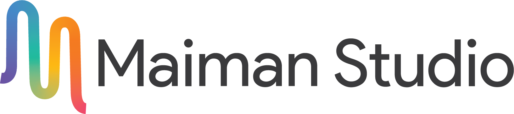

<h1>
  <picture>
    <source media="(prefers-color-scheme: dark)" srcset="assets/logo-wordmark.png">
    
  </picture>
</h1>

**An open-source, modular simulator for optical communication links and photonic systems.**

*Named for **Theodore Maiman**, who fired the first working laser in May 1960 — the event every
link in this simulator descends from.*

[](https://github.com/ehsun-sh/maiman-studio/actions/workflows/ci.yml)


---

**Version 0.17.0** · 77 components · more than 2250 tests · every physics block checked against a
closed-form result in CI. 0.x means the API is not stable yet.


## What it does

- **Visual link designer.** Drag blocks onto a canvas, wire them, press Run, sweep a parameter and
  save the project. Every number on screen comes from the engine.
- **Direct-detection links.** PRBS → NRZ/PAM4 → laser → modulator → fiber → PIN/APD, with eye
  diagrams, Q and BER.
- **Coherent links.** M-QAM up to 256, RRC shaping, IQ modulator, 90° hybrid, and a blind DSP
  receiver (timing, frequency and phase recovery), dual polarization with a butterfly equaliser.
- **WDM and amplifiers.** Coupled split-step propagation with SPM/XPM/FWM, EDFAs with ASE,
  saturation and gain transients, OSNR and the Q that follows from it, ROADM nodes.
- **Forward error correction.** RS(255,239) per G.709 and soft-decision staircase/OFEC decoding.
- **Photonic circuits.** Bidirectional S-matrix solver, rings, gratings, couplers, PDK import, and
  gdsfactory netlists read without importing gdsfactory.
- **Scriptable from Python.** The studio and the library are the same engine.

## Install and run

You need **Python 3.11 or newer** ([python.org/downloads](https://www.python.org/downloads/); on
Windows tick *"Add python.exe to PATH"*). Then, in a terminal:

```
pip install maiman
maiman serve
```

Open **http://127.0.0.1:8765/** in your browser. A complete example link is already on the canvas:
press **Run**. The *Examples* menu opens many more, each with a lesson beside it.

On macOS and Linux use `python3 -m pip install maiman`. To update: `pip install --upgrade maiman`.
From a checkout, `python tools/make_shortcut.py` makes a **Maiman App** shortcut you can
double-click.

New to Python or the terminal, or hit an error? The [step-by-step install guide](docs/install.md)
starts from nothing and lists every common failure and its fix.

### From Python

```python
from maiman import Graph, SimulationContext
from maiman.components import CWLaser, Fiber, PowerMeter

ctx = SimulationContext(bit_rate=10e9, samples_per_symbol=16, sequence_length=64)
link = Graph(ctx)
laser = link.add(CWLaser(power=0.0, wavelength=1550.0))
fiber = link.add(Fiber(length=80.0, attenuation=0.2))
meter = link.add(PowerMeter())
link.chain(laser, fiber, meter)
print(f"received power: {link.run()[meter].power_dbm:.2f} dBm")   # -16.00 dBm
```

More in [`examples/python/`](examples/python/).


## Documentation

The full documentation lives in [`docs/`](docs/index.md) and is published at
[maimanstudio.com/docs](https://maimanstudio.com/docs/).

| | |
| :--- | :--- |
| [Installing](docs/install.md) · [Quickstart](docs/quickstart.md) | From no Python at all to a first link, and every error on the way |
| [The studio](docs/studio.md) | The editor, runs, sweeps, the spectrum dock, lessons |
| [Graphs, ports and runs](docs/graphs.md) · [The signal model](docs/signal-model.md) | How the engine works |
| [Models and results](docs/models.md) · [Validation](docs/validation.md) | Every physics model, and how each is checked |
| [Component reference](docs/components/index.md) · [Python API](docs/api.md) | Generated from the code |
| [Release notes](docs/releases.md) · [Roadmap](docs/roadmap.md) | What changed, and what is next |
| [Architecture](docs/ARCHITECTURE.md) · [Writing a component](docs/writing-components.md) | For contributors |

## Contributing

Issues and pull requests are welcome; a physics block that disagrees with the literature is the
most valuable report. See [CONTRIBUTING.md](CONTRIBUTING.md), and [SECURITY.md](SECURITY.md) for
private security reports.

```bash
pip install -e ".[dev]" && ruff check . && ruff format --check . && mypy && pytest
```

## Citing and license

Cite via [`CITATION.cff`](CITATION.cff) (GitHub's "Cite this repository" button), and please cite
the primary sources each component's docstring names. Licensed under [Apache-2.0](LICENSE).
