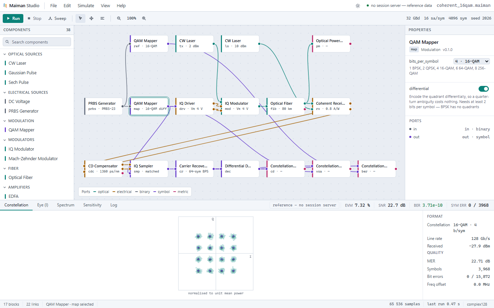
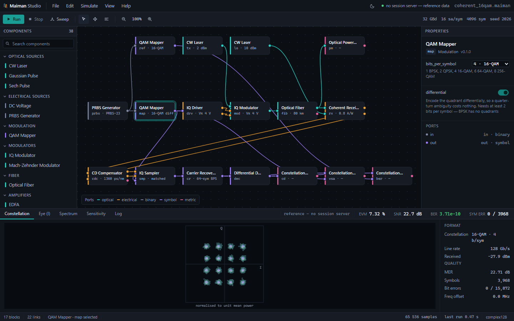

# The studio interface

[← README](../README.md) · [Getting started](getting-started.md) · [The studio interface](interface.md) · [Models and results](physics.md) · [Design and roadmap](design.md) · [Validation](validation.md)

---

## The interface

**It runs.**

    pip install maiman
    maiman serve

then open `http://127.0.0.1:8765/`. The interface is a file inside the package, so installing the
engine installs it — there is nothing to build and no checkout to be standing in. From a checkout,
`python -m maiman.server` is the same command by another name. Press Run and the page posts its graph to the engine and draws
what comes back: the constellation, the measurements, the block captions, and a log in which every
line is a fact from the response. Change a parameter in the inspector and run again, and the
numbers move because the physics moved — set the fiber to 200 km and the received power drops by
exactly the 24 dB the extra loss costs, while the constellation collapses, because the dispersion
compensator is still set for the old span.

**The canvas draws the project document itself.** The blocks, the wires and the parameter values
are not written into the page. They are read from the same `.maiman` document the server accepts,
exported from the graph that produced the reference numbers, and Run posts that object straight
back. So the picture on the canvas, the values in the inspector and the graph the engine executes
are one description instead of three kept in agreement by hand — the hand-written copy that used
to live in the page had already drifted, and was missing four of the fiber's parameters.

**It is an editor.** Drag a block to move it. Drag from an output port to an input to wire them.
Click a component in the palette to add it, select a block or a wire and press Delete to remove it,
ctrl+Z to take it back. Then Run, on a graph that did not exist a minute ago.

A connection is refused while it is being dragged rather than when Run is pressed, and the refusal
says why — `binary cannot drive optical`, `fib.in already has a source`, `a block cannot feed
itself`. Port types are what make that possible, and it is the reason they have been in the signal
model since the first commit. An input with nothing feeding it is drawn hollow, because the engine
will refuse to run the graph and showing which port is the problem beats reporting it afterwards.

Built without React Flow, on the SVG canvas that was already there. That was a judgement call
against what PRODUCT.md had written down, taken because React Flow means npm and a bundler and this
project has no build step at all — the page still opens straight off disk with nothing installed,
which is how the README asks you to read it. The interaction layer is the part that would have had
to be written either way.

**A run says how far along it is.** Not a spinner: the response streams, and the bar in the menubar
is drawn from a fraction the engine has already reported — components behind this point, plus the
fraction *within* the one running. That second part is what makes it useful, because in a link with
a long span one block is the entire run: the split step reports the distance it has travelled after
every step, so a 16-second span moves the bar 268 times instead of resting on `fib` for the whole
of it. It is deliberately not a time estimate. A run has no estimate before it starts, and the one
honest quantity available is how much of the work is behind it.

Stop aborts the response rather than the run. Block-mode execution has no safe place to stop
halfway, so the engine finishes and its answer is discarded — and the log says that in those words,
because an interface that implies a cancellation it did not perform is worse than one that cannot
cancel. The button was enabled for the whole of every run and wired to nothing until there was
something real to abort.

**Sweeps.** A single run answers *what does this link do*; a sweep answers *how far can it go*,
which is the question that gets asked more often. Pick a block and a parameter, give it a range,
and the curve appears beside the form that made it. Repeats draw the spread at each point, because
one BER estimate at a marginal operating point is a sample and not an answer. The endpoint sends
back **numbers, not pictures** — a curve is made of scalars, and shipping a 96×96 histogram at
every point would be megabytes to draw a line. Seven points of a coherent link is 6 kB.

The plot opens on the metric that *moved*. A sweep is run to watch something change, so the one
that changed most is the one worth showing — which is also what stops it opening on the analyser
downstream of the decoder, whose EVM is exactly zero at every point because it is looking at
symbols that have already been decided.

**Points run at the same time, and the answer does not know it.** `sweep(..., workers=4)` — or
`workers=None` for one per core — runs four points at once, each on its own deep copy of the graph.
Measured 3.2× on an eight-point nonlinear span sweep, and **bit-identical** to the sequential
result, in sweep order, however many workers ran it. That last part is the whole claim: a sweep
whose numbers moved with the thread count would be worthless as a measurement, and the failure
would not look like a crash — it would look like a curve with the right shape and the wrong values.

Threads rather than processes. Measured, the two are the same speed on this work — 3.25× against
3.14× on twelve workers — because the time goes into numpy's FFTs, which release the GIL, and
because a split step is memory-bound long before it is core-bound. Threads then win on everything
else: nothing to pickle, no interpreter to start, and no objection to a component you defined in a
notebook. The copies are what make it safe — a run *writes* a point's overrides onto the components
and rolls them back after, so two threads sharing one graph would produce numbers belonging to
neither point.

The default is one worker, because a sweep of four cheap points is slower to parallelise than to
run. The session server uses four: a browser is holding a connection open for the whole of a sweep,
which is the case this was built for, but taking all twenty-four cores for a curve somebody asked
for by clicking a button is not a trade a design tool gets to make on its own.

**The spectrum is drawn, not summarised.** An Optical Spectrum Analyzer anywhere on the graph puts
its trace in the dock: wavelength across, dBm per resolution bandwidth up, the peak marked at the
wavelength it was found at. The axis is labelled in the analyser's own resolution because the trace
*is* — an OSA reports power within its resolution, so widening the setting lifts the ASE floor
decibel for decibel and leaves the channels, already narrower than either setting, exactly where
they were. That asymmetry is the whole reason an OSNR figure is meaningless without the bandwidth
it was quoted in, and it is one parameter and one Run away from being seen rather than described.
The OSNR beside the trace comes from an OSNR meter on the graph and is left empty when there is
none: a figure read off the displayed curve would move with the resolution knob and would not be
the OSNR anyone means. `examples/maiman/wdm_osa.maiman` opens four channels on the 100 GHz grid through
two amplified spans, which is what the trace baked into the page is a run of.

**A block's own spectrum.** Select a grating, a ring, a coupler or any other photonic block and its
properties carry *Show its S-matrix spectrum*: the S-matrix tab draws every entry of its scattering
matrix across a window — as power, phase or group delay — without a link run through it. The
window starts where the device is worth looking at (a grating's line, four of a ring's free spectral
ranges) and can be moved anywhere. The engine does the work: `POST /api/spectrum` builds the block
from the same node a run would and calls `spectrum()` on it, which a script can call just the same.
Group delay is a local derivative, `S(f + δ)` against `S(f)`, not a differenced unwrap of the
sampled phase: the unwrap made a straight waveguide's 14 ps into −1 ps as soon as the grid was
coarser than its delay, and the derivative has no such limit. Where an entry is 40 dB below its own
peak its phase means nothing, and the plot leaves a gap rather than drawing the spike. A 10 mm
Bragg grating reads 48 ps away from its line — one transit — and 72 ps at the band edge.

**Open and save.** `File → Save` writes a `.maiman` file: the same document the canvas draws, the
same one the server runs, with the block positions folded in. `File → Open` reads one back. Both
go through the browser — the file is chosen in the operating system's own picker and read locally,
and nothing is posted. A server that opened or wrote a path it was handed would be a different and
much worse program, and it would gain nothing: the file belongs to the person at the keyboard.
A file that is not a project says so and leaves the canvas alone rather than emptying it first and
explaining second.

The page also still opens straight off disk with nothing running, which is how it should be read
if you only want to look. It says which mode it is in rather than leaving it to be inferred: a
badge in the results dock reads **live** when the numbers came from this session's last run,
**stale — graph edited** when the graph has changed since, and **reference** when they came from
the run baked into the file. Numbers from four days ago and numbers from the last click must never
look alike. See [DESIGN.md](../DESIGN.md) for why the rest of it looks like this.

It ships two grounds and defaults to paper, because a schematic is a document before it is a
screen and its plots leave the tool for reports and papers. Graphite is one click away:

Every wire colour is a wavelength rather than a preference — optical C-band cyan, electrical amber,
binary slate, symbol violet, metric magenta — so a glance at a link tells you what travels down it.
A typed-port system that refuses invalid wiring at edit time is worth nothing if the types are
invisible.

---

## The session server

    maiman serve

Three routes, no dependencies beyond the ones the engine already has, bound to loopback.

| route | what it does |
| :--- | :--- |
| `GET /api/manifests` | Every registered component: parameters with units and bounds, ports with types |
| `POST /api/run` | A `.maiman` project document in, results out |
| `POST /api/sweep` | A project, an axis and a range in; a curve out, as numbers |
| `GET /api/health` | Whether it is up, and how many components it knows |

**It is an ordinary client of the public Python API.** Every route is a thin wrapper over something
a script can already call — `manifests()`, `graph_from_dict()`, `Graph.run()`. Nothing in the
server knows any physics and nothing in the engine knows the server exists, which is what stops
the two drifting apart: a feature unreachable from Python is unreachable from the interface too.
The `Results.items()` the server needs is public for the same reason.

**Reduction happens in the engine, never in the browser.** A run holds tens of thousands of samples
per port; an eye diagram drawn from them is a 96×96 histogram. So a signal-carrying port encodes to
a *summary* — how many samples, at what rate, how much power — and anything meant to be looked at
arrives already reduced, from a measurement component the graph contains explicitly. A full
coherent run is **52 kB of JSON**. That is not a size optimisation: it is what keeps a second,
untested implementation of the physics from growing in JavaScript.

Every encoded value carries a `kind`, so a client switches on a string rather than guessing from
which fields happen to be present. A result type nothing knows how to draw arrives tagged `opaque`
rather than failing the run or being guessed at — which is the honest answer for a plugin's own
metric, and a test asserts it is never the answer for anything shipped here.

Non-finite numbers become `null`. `json.dumps` emits bare `NaN` and `Infinity`, which are not JSON
and which `JSON.parse` rejects outright, so one infinite Q factor would fail a whole response
rather than one field — and infinities are a normal result here, not an error.

**Errors say whose fault they are.** 400 means the request could not be read, 422 means it was read
and will not run, 413 means it was too big to attempt:

| | |
| :--- | :--- |
| `no component registered as 'FluxCapacitor'. If it comes from a plugin package…` | 400 |
| `a window of 32000000 samples exceeds the server limit of 4194304` | 413 |
| `pm.in is not connected` | 422 |

`POST /api/run` executes the graph it is given, so the socket binds to 127.0.0.1 unless a host is
passed explicitly, and a run is refused *before* it starts if its window is too large. The registry
already does the harder half of this: a project file may only **name** components that are already
registered and can never import a dotted path, so opening someone else's project is not equivalent
to running their code.
